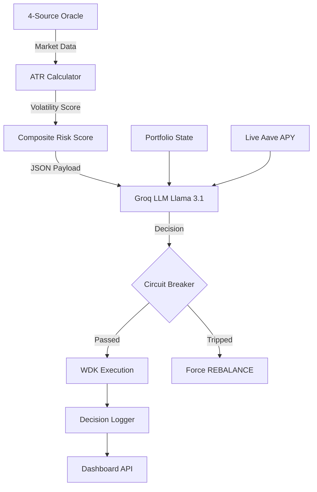

# XAU₮Anchor System Architecture

XAU₮Anchor is built as a closed-loop autonomous system. It combines off-chain intelligence with on-chain execution via Tether WDK.

## The Autonomous Loop

## Component Breakdown

1.  **Observation Layer (`oracle.js`, `aave.js`):** Pulls Fear & Greed, BTC/ETH/Gold prices, and real-time Aave lending rates.
2.  **Reasoning Layer (`reasoner.js`):** Uses Groq Cloud (Free Tier) to process data and output structured JSON decisions.
3.  **Safety Layer (`index.js`):** Intercepts LLM decisions if a 15% drawdown is detected.
4.  **Execution Layer (`wallet.js`, `swapper.js`, `aave.js`):** Uses WDK to sign and broadcast transactions to Polygon Amoy.
5.  **Audit Layer (`logger.js`):** Writes every thought and action to a permanent JSON log.
